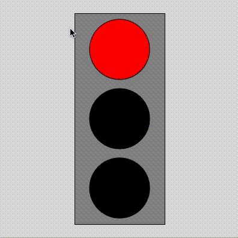

# Traffic Light Conditions
Adam and Patti

## Task
Code a working traffic light that turns specific lights based on the mouse position.

## Learning Targets
* I can code conditions using p5 built in variables.

## Starter Code
* [Level 0](https://editor.p5js.org/awdriggs/sketches/8I08ju5bE) - Code a Red/Green Traffic Light
* [Level 1](https://editor.p5js.org/awdriggs/sketches/beCjy6xOe) - Code a Red/Yellow/Green Traffic Light, lots of code stems
* [Level 2](https://editor.p5js.org/awdriggs/sketches/XT2GtqtIQ) - Code a Red/Yellow/Green Traffic Light, minimal code stems

## Hints
* `height` is a variable the will always be equal to the height of the canvas
* `mouseX` is a variable that will always equal the current horiziontal position, left and right
* `mouseY` is a varable that will always equal the current vertical position, up and down

## Solution - Don't Peak!
[Solution](https://editor.p5js.org/awdriggs/sketches/G2_E_vvl3)
