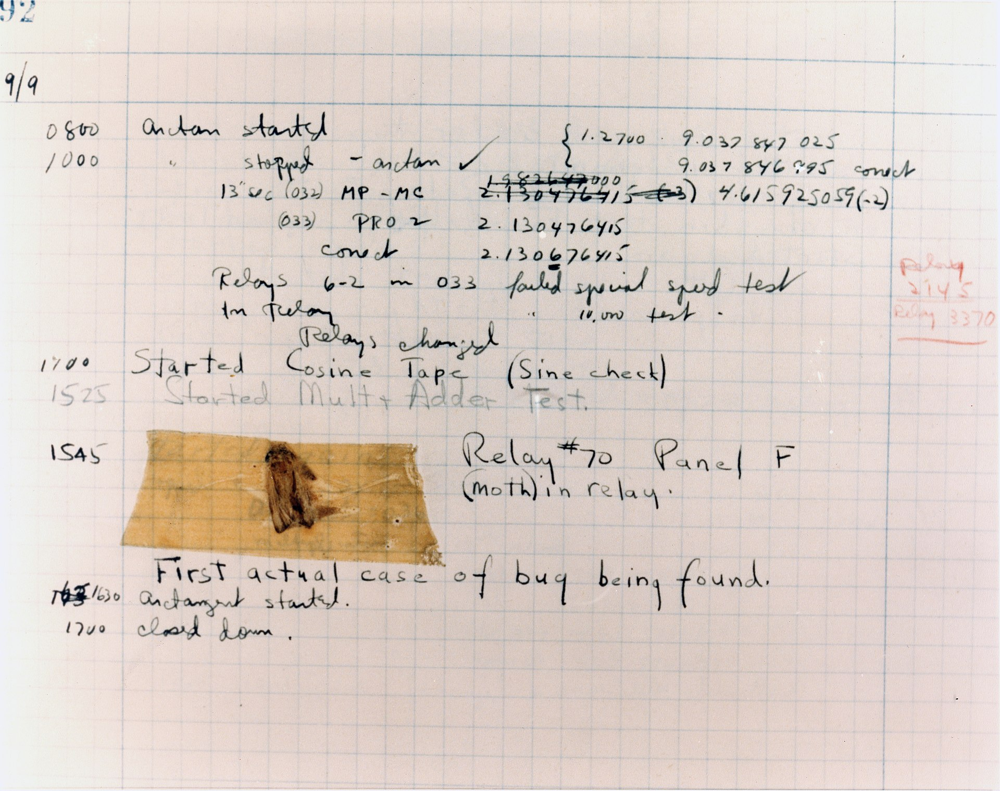

# Debug Lesson

## What is a bug?
The term "bug" to describe problems and has been a part of engineering jargon since the 1870s. The term was used before computers were invented.


In 1946, when Grace Hopper traced an error in the Mark II, and early computer, to a moth trapped in the computer which caused a problem. This bug was carefully removed and taped to the log book. From this first actual bug, today we call errors or glitches in a program a bug.

source: [Wikipedia](https://en.wikipedia.org/wiki/Software_bug#:~:text=Operators%20traced%20an%20error%20in,in%20a%20program%20a%20bug.)

## Type of Bugs
**Syntax Errors:** As programmers, we often make mistakes and introduce bugs in our code with bad syntax. These are often found by the compiler. 

**Logic Errors:** Logic errors WON'T be caught by the compiler. They happen when our logic is wrong. Maybe we should have used a `>=` instead of `>`. Logic errors are harder to find and it is helpful to use print statements to track down errors. 

## Your Task
* This function has some 1 syntax and 2 logic errors.
* Use `System.out.println();` to track down the bugs.
  * For example this statement `System.out.println("index: " + i);` would print the value of i for each step of the for loop.
* Compile and run each time you add a statement to see what prints. 

```java
 public static int findMaxValue( int[] data ) {
    int m=0;  
    for (int i = 0; i >= data.length; i++){
      if (data[i]<m){
        m = data{i};
      }
    }

    return m;
  }
```

* Use the starter file `arrayBugs.java`.
* When you find an error, fix it, then write a comment saying whether it was a logic error or syntax error.
* If you finish, become an expert. Travel around the room helping others. Don't give away answers! Lead students with questions.
  
  
 
  
